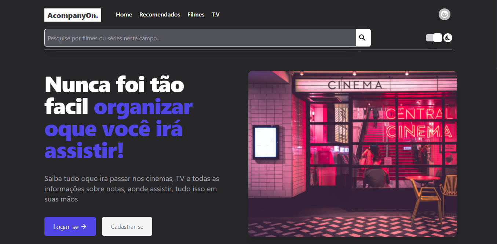
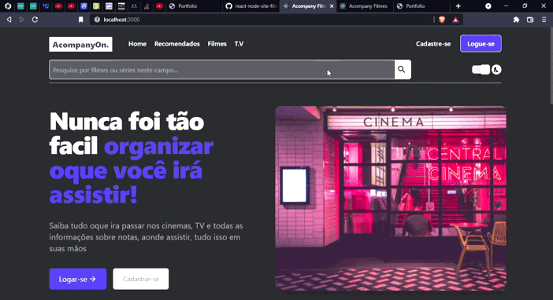

<!-- Badges session -->

  
  <!-- languages -->
  
  <!-- repo size -->
  
  <!-- last commit -->
  
  <!-- licence MIT -->
  

<!--Banner session-->

  

<!--About session-->
<h1 align="center">Site para Gerenciamento de listas de filmes e séries AcompanyOn</h1>

Criei um site que contém as principais funcionalidades de um site administrativo profissional para incluí-lo ao meu portfólio, o usuario poderá criar uma conta, logar, alterar suas informações, e favoritar e criar uma lista de espera para organizar todos os filmes e/ou séries que eles querem ou vão assistir.

As imagens dos filmes incluídos neste projetos foram retiradas do site [The Movie Database - TMDb](https://www.themoviedb.org/). O carousel foi criado através de uma bibliotéca chamada SwipperJs [SwipperJs](https://swiperjs.com/), no site contém vários exemplos de carousel.

<h3>🏠 Projeto hospedado na Netilify: </h3>

[Clique aqui, e veja como o projeto está ficando...](https://acompanyon.netlify.app/)

<h3>🏠 Landing Page e suas funcionalidades</h3>

<h3>🌞🌚 Temas Dark e Light totalmente funcional</h3>

<h3>🤓 Todas as Páginas totalmente responsivas!</h3>

<h3>🤓 Paginas de cadastro e de login funcionais</h3>

<h3>🤓 Pagina de detalhes dos Filmes/Séries puxando através de uma API externa</h3>

<h3>👨‍💻 Tecnologias utilizadas</h3>

- [HTML](https://www.w3schools.com/html/)
- [CSS](https://developer.mozilla.org/pt-BR/docs/Web/CSS)
- [JavaScript](https://developer.mozilla.org/en-US/docs/Web/JavaScript)
- [ReactJS](https://pt-br.reactjs.org/)
- [AXIOS](https://axios-http.com/)
- [Typescript](https://www.typescriptlang.org/)
- [TailwindCSS](https://tailwindcss.com/)
- [SwipperJS](https://swiperjs.com/)
- [MUI](https://mui.com/)
- [Laravel](https://laravel.com/)

<!--License session-->
<h3>📝 Licença</h3>

- Este projeto está sob a licença [MIT](./LICENSE).

<h3> 🚧 Funcionalidades ainda a serem implementadas 🚧 </h3>

- Paginas para mostrar todos os favoritos e watchlist
- Pagina e CRUD da parte de informações do usuario
- Criar History dos usuarios e por isso em um Dashboard
- Por um loading na hora de favoritar ou de por na lista de espera

<!--Bottom session-->
 <h4 align=center>Feito por <a target="_blank" href="https://robert-office.github.io/robert-curriculum" >Robert Uillians</a></h4>
